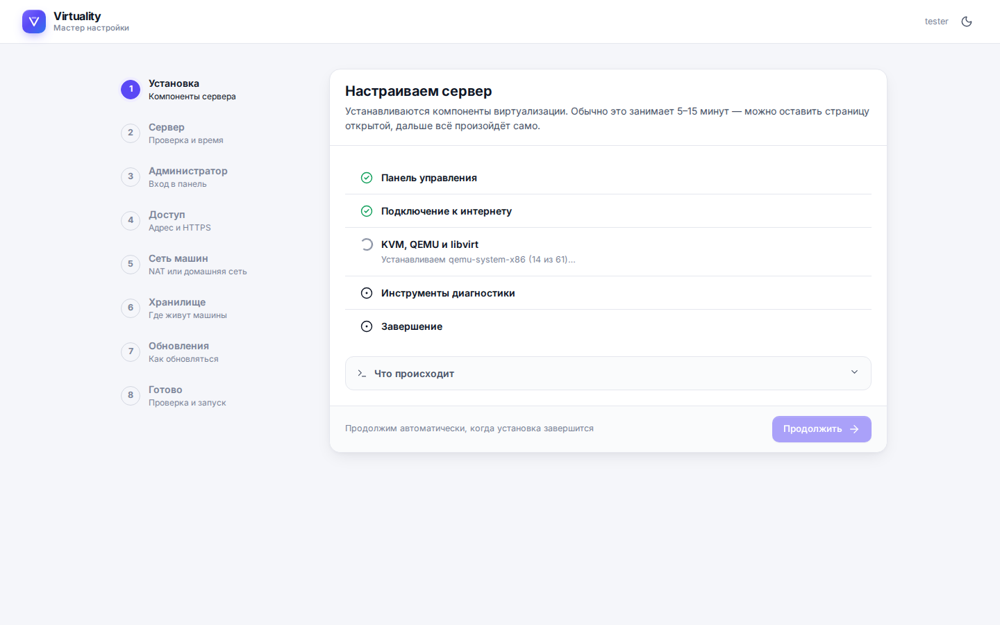
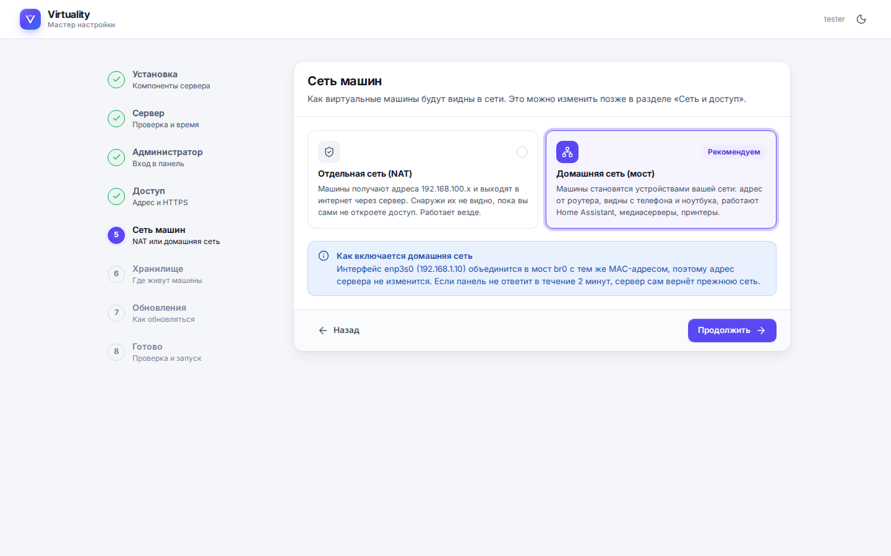
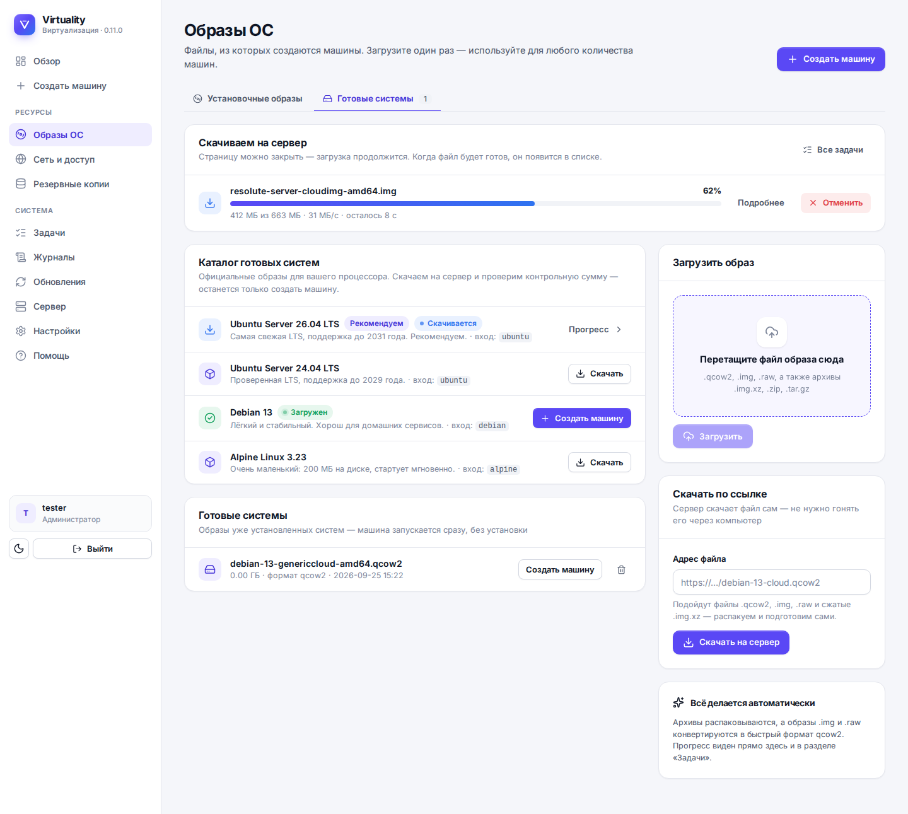
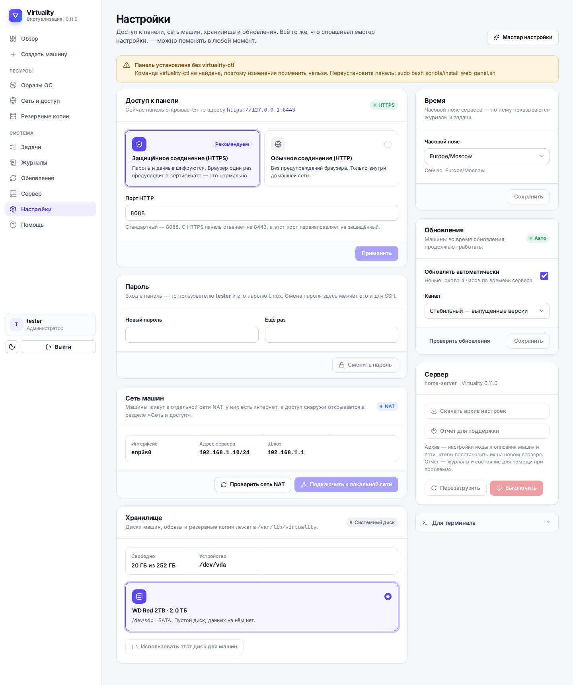
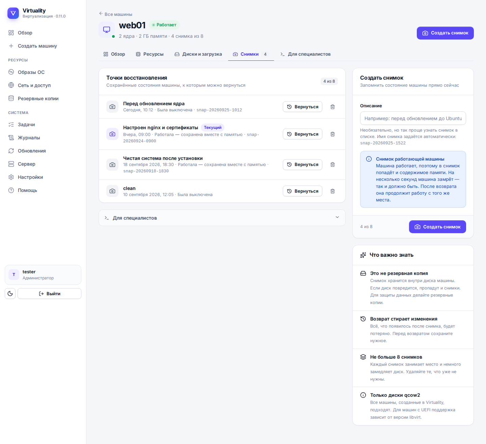
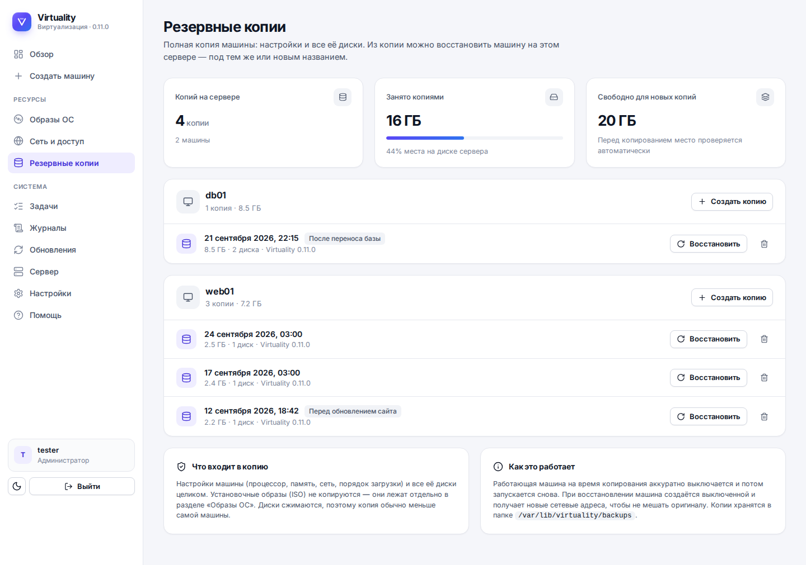
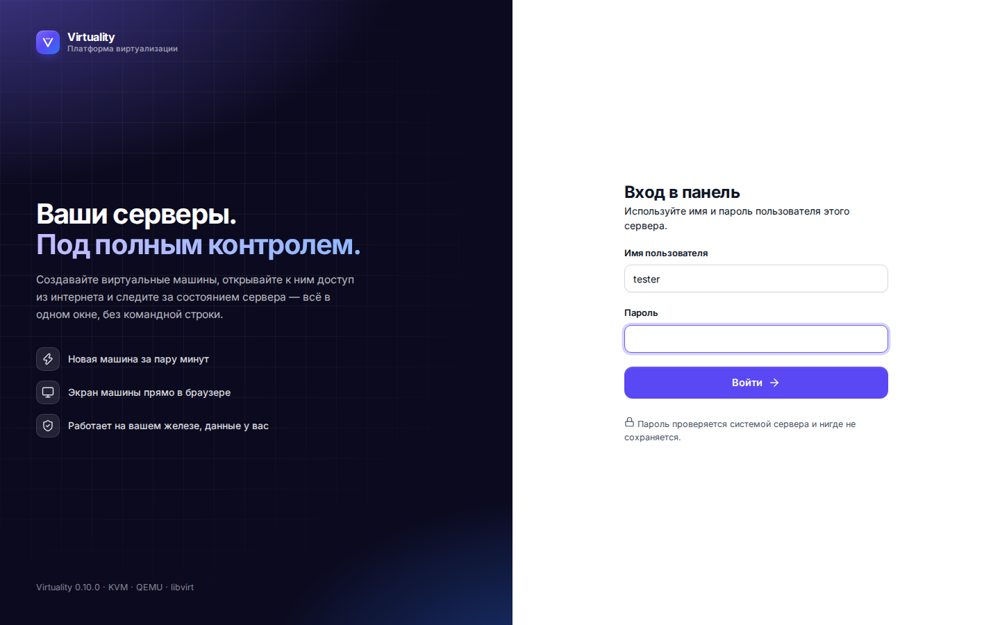
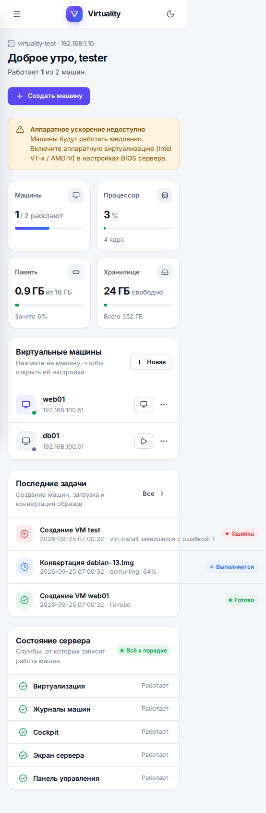

# Virtuality

**Virtuality** — простая замена Proxmox для дома и малого офиса. Один сервер, виртуальные машины и понятная панель в браузере на русском языке. Внутри — проверенные KVM, QEMU и libvirt, снаружи — интерфейс, в котором не нужна командная строка.

Текущая версия: **0.11.0** (файл `VERSION`, журнал изменений — `updates/versions.json`).

Что умеет:

- ставится с готового ISO-образа, как Proxmox: три экрана установщика — и через несколько минут панель открыта в браузере;
- создаёт машины из установочных ISO (в том числе Windows 11) и за минуту — из готовых облачных образов Ubuntu, Debian и Alpine;
- снимки, резервные копии, клонирование, увеличение диска, спящий режим;
- сеть машин «из коробки»: отдельная сеть NAT с постоянными адресами и пробросом портов или ваша домашняя сеть через мост;
- экран машины прямо в браузере, HTTPS для панели, автообновления со стабильным каналом.


| Мастер создания машины | Страница машины |
|---|---|
|  |  |

| Сеть и доступ | Тёмная тема |
|---|---|
|  |  |

| Мастер настройки: установка | Мастер настройки: сеть машин |
|---|---|
|  |  |

| Каталог готовых систем | Настройки |
|---|---|
|  |  |

| Снимки | Резервные копии |
|---|---|
|  |  |

| Вход | На телефоне |
|---|---|
|  |  |

---

## Содержание

- [Установка](#установка)
  - [Способ 1: установочный ISO](#способ-1-установочный-iso)
  - [Способ 2: одна команда на готовый сервер](#способ-2-одна-команда-на-готовый-сервер)
  - [Способ 3: вручную](#способ-3-вручную)
- [Первая загрузка и мастер настройки](#первая-загрузка-и-мастер-настройки)
- [Возможности](#возможности)
- [Настройки](#настройки)
- [Команда virtuality-ctl](#команда-virtuality-ctl)
- [Обновления и откат](#обновления-и-откат)
- [Удаление](#удаление)
- [Если что-то не работает](#если-что-то-не-работает)
- [Где что лежит](#где-что-лежит)
- [Разработка](#разработка)

Подробные документы: [требования](docs/REQUIREMENTS.md) · [установочный образ](docs/IMAGE.md) · [первая машина](docs/FIRST_VM.md) · [архитектура](docs/ARCHITECTURE.md) · [планы](docs/ROADMAP.md).

---

## Установка

Перед установкой проверьте [требования](docs/REQUIREMENTS.md): процессор x86_64 с включённой виртуализацией (Intel VT-x / AMD-V), от 4 ГБ памяти, проводная сеть.

### Способ 1: установочный ISO

Самый простой путь для «голого» сервера или старого компьютера. Образ собирается из чистого Ubuntu Server 26.04 LTS; установщик спрашивает только сеть, диск и пользователя.

Где взять образ:

- **GitHub Actions.** Откройте вкладку Actions репозитория → workflow **Build ISO image** → последний успешный запуск → раздел Artifacts → `virtuality-iso-amd64` (или `virtuality-iso-arm64`). Внутри архива — `.iso` и файл `.sha256`. Артефакты хранятся 30 дней; новый образ собирается при каждом выпуске (тег `vX.Y.Z`), запустить сборку вручную можно кнопкой Run workflow.
- **Собрать самому** на любой Linux-машине (root не нужен):

  ```bash
  sudo apt install -y xorriso git curl python3-pip
  git clone https://github.com/viktor138irk/virtuality.git
  cd virtuality
  make iso                 # dist/virtuality-0.11.0-ubuntu-26.04-amd64.iso
  ```

Дальше: записать образ на флешку (Rufus, balenaEtcher или `dd`), загрузиться с неё, выбрать **Установить Virtuality**, ответить на три экрана установщика и дождаться перезагрузки. Через минуту после неё панель уже открывается в браузере — адрес показан на экране сервера. Все подробности, параметры сборки и полностью автоматическая установка — в [docs/IMAGE.md](docs/IMAGE.md).

### Способ 2: одна команда на готовый сервер

Подходит для уже установленного Ubuntu Server 24.04 / 26.04 или Debian 13. Работает и под `root`, и под обычным пользователем с `sudo`:

```bash
curl -fsSL https://raw.githubusercontent.com/viktor138irk/virtuality/main/install.sh | bash
```

Скрипт проверит требования, поставит пакеты KVM/QEMU/libvirt, команду `vhealth` и панель, а в конце покажет адрес панели. Логин — тот пользователь, от которого запущена установка (через `sudo` — ваш пользователь, под `root` — `root`); пароль — его пароль Linux. Если пароль ещё не задан: `sudo passwd <пользователь>`.

Переменные окружения, которые понимает `install.sh`:

```text
VIRTUALITY_USER=admin        # какой Linux-пользователь входит в панель (будет создан, если его нет)
VIRTUALITY_WEB_PORT=8089     # порт панели (по умолчанию 8088)
VIRTUALITY_AUTO_UPDATE=0     # не включать ночное автообновление
VIRTUALITY_BRANCH=main       # ветка репозитория
VIRTUALITY_INSTALL_VERBOSE=1 # показывать вывод команд вместо спиннера
```

Пример:

```bash
curl -fsSL https://raw.githubusercontent.com/viktor138irk/virtuality/main/install.sh | VIRTUALITY_USER=admin bash
```

При первом входе в панель откроется мастер настройки — тот же, что после установки с ISO.

### Способ 3: вручную

Если хочется видеть каждый шаг. Всё делается от `root` или через `sudo`:

```bash
sudo mkdir -p /opt/virtuality
sudo git clone https://github.com/viktor138irk/virtuality.git /opt/virtuality/source
cd /opt/virtuality/source
sudo bash install_virtuality_node.sh                  # пакеты KVM/QEMU/libvirt, пулы, firewall
sudo bash scripts/install_healthcheck_command.sh      # команда sudo vhealth
sudo VIRTUALITY_AUTH_USER=admin bash scripts/install_web_panel.sh   # панель и virtuality-ctl
```

`install_web_panel.sh` копирует панель в `/opt/virtuality/web`, создаёт virtualenv, ставит `virtuality-ctl` и через него — systemd-юниты и правила firewall. Переменные: `VIRTUALITY_AUTH_USER` (пользователь для входа), `VIRTUALITY_WEB_PORT` (порт), `VIRTUALITY_AUTO_UPDATE` (0/1). Повторный запуск скрипта обновляет панель, сохраняя настройки.

---

## Первая загрузка и мастер настройки

### Что происходит после установки с ISO

После перезагрузки запускается `virtuality-firstboot.service` (`scripts/virtuality_firstboot.sh`). Порядок шагов выбран так, чтобы вы как можно раньше увидели, что происходит:

1. **Панель управления** — ставится офлайн из Python-колёс, упакованных в образ, и сразу запускается. Открывайте `http://адрес-сервера:8088` — мастер покажет ход остальных шагов прямо в браузере.
2. **Подключение к интернету** — ожидание сети. Если кабель не подключён, мастер напишет об этом и продолжит сам, как только интернет появится.
3. **KVM, QEMU и libvirt** — самый долгий шаг, обычно 5–15 минут: пакеты ставятся из репозиториев Ubuntu, мастер показывает, какой пакет скачивается или настраивается.
4. **Инструменты диагностики** — команда `vhealth`.
5. **Завершение** — `virtuality-ctl reconfigure`: юниты, firewall, перезапуск панели.

Ход установки пишется в `/var/lib/virtuality/config/setup.json` и в `/var/log/virtuality/firstboot.log`. Если какой-то шаг упал (например, отвалилась сеть), systemd перезапускает скрипт через минуту, и он продолжает с первого незавершённого шага. На экране сервера (tty) всё это время показана подсказка, а после завершения — адрес панели и логин.

Логин в панель — пользователь, созданный в установщике Ubuntu; пароль — его пароль.

### Мастер настройки

Мастер (`/setup`) открывается при первом входе в панель — и после ISO, и после `install.sh`. Каждый шаг можно пропустить, а весь мастер — запустить заново из раздела «Настройки».

| Шаг | Что делает |
|---|---|
| **Установка** | Показывает ход первой загрузки (только после ISO). |
| **Сервер** | Проверяет процессор, память, диск и доступность KVM; задаёт часовой пояс. |
| **Администратор** | Смена пароля пользователя панели (он же пароль SSH). |
| **Доступ** | HTTPS с сертификатом сервера (панель на порту 8443, с 8088 — перенаправление) или обычный HTTP; порт. |
| **Сеть машин** | **Отдельная сеть (NAT)** — машины получают адреса 192.168.100.x, работает везде. **Домашняя сеть (мост)** — машины становятся устройствами вашей сети; сервер сам перестроит сеть в мост `br0`, а если панель не ответит за 2 минуты — вернёт всё как было. |
| **Хранилище** | Отдать пустой диск (от 16 ГБ) под машины: он форматируется и монтируется в `/var/lib/virtuality`. Или оставить системный диск. |
| **Обновления** | Автоматически ночью (только выпущенные версии) или вручную; канал: стабильный или ранний доступ. |
| **Готово** | Сводка; настройки применяются, при смене адреса панель перезапускается и открывается по новому. |

---

## Возможности

Разделы панели: **Обзор**, **Создать машину**, **Образы ОС**, **Сеть и доступ**, **Резервные копии**, **Задачи**, **Журналы**, **Обновления**, **Сервер**, **Настройки**, **Помощь**.

**Машины**

- Создание из установочного ISO: три шага — название и система, мощность (готовые профили «Мини», «Стандарт», «Мощная» или свои значения), сеть.
- Тип системы для ISO: Linux, **Windows 11 / Server 2025** (UEFI и TPM 2.0 включаются сами), Windows 10 / Server 2019–2022, другая. Для Windows подбираются диск SATA и сетевая карта Intel — драйверы не нужны.
- Создание из готового образа за минуту: образ конвертируется в qcow2, диск увеличивается до нужного размера, а cloud-init настраивает первый вход — пользователя, пароль и/или SSH-ключ. Пароль хранится только как хеш. При первой загрузке в машину ставится гостевой агент, поэтому панель видит её адрес в любой сети и выключает её корректно.
- Запуск, выключение, перезагрузка, принудительное выключение, автозапуск, удаление вместе с дисками.
- Пауза и **спящий режим** (память сохраняется на диск сервера, после запуска машина продолжает с того же места).
- Изменение процессора и памяти, порядок загрузки, привод CD/DVD (вставить или извлечь образ).
- **Увеличение диска**, **клонирование** (точная копия с новым именем и своим адресом), заметки (название и описание), живая нагрузка процессора и памяти.
- **Экран машины в браузере** (noVNC). VNC наружу не открыт: консоль доступна только через панель.

**Снимки и копии**

- **Снимки** — точки восстановления внутри диска машины, до 8 на машину. У работающей машины в снимок попадает и память. Вернуться или удалить — одной кнопкой.
- **Резервные копии** — полная копия настроек и всех дисков в `/var/lib/virtuality/backups/<машина>/<дата>/`. Восстановление под тем же или новым названием; копию можно делать и по расписанию из командной строки.

**Образы ОС**

- Загрузка ISO и образов дисков перетаскиванием (с прогрессом и скоростью), поддержка `.qcow2`, `.img`, `.raw`, сжатых `.img.xz` и архивов.
- **Скачивание по ссылке** — сервер качает файл сам, в фоне.
- **Каталог готовых систем** — официальные облачные образы Ubuntu Server 26.04 LTS и 24.04 LTS, Debian 13, Alpine Linux 3.23 с проверкой контрольных сумм.

**Сеть**

- Сеть **NAT** `virtuality-nat` (192.168.100.0/24): каждая машина получает **постоянный адрес** по имени, поэтому пробросы портов не ломаются после перезагрузок.
- **Проброс портов** из списка готовых сервисов (SSH, сайт, RDP, Minecraft, VPN и другие) или любой порт и диапазон; проверка правила одной кнопкой; правила переживают перезагрузку сервера.
- **Домашняя сеть через мост** `br0` с автооткатом, если сеть пропала.

**Сервер**

- Мастер настройки и страница «Настройки».
- **HTTPS** для панели с сертификатом сервера и перенаправлением с HTTP.
- **Обновления** из панели или автоматически ночью, **стабильный канал** (только выпущенные версии) и ранний доступ, откат на предыдущую версию.
- Задачи с прогрессом и журналом, журналы служб, диагностика `vhealth`, отчёт для поддержки, архив настроек.
- Светлая и тёмная темы, работает на телефоне, не требует доступа в интернет для самой панели.

Как сделать первую машину — в [docs/FIRST_VM.md](docs/FIRST_VM.md).

---

## Настройки

Страница **Настройки** (`/settings`) — всё то же, что в мастере, плюс управление сервером:

- **Доступ к панели** — HTTPS или HTTP, порт. После применения панель перезапускается и открывается по новому адресу.
- **Пароль** — смена пароля пользователя панели (он же пароль Linux и SSH).
- **Сеть машин** — переключение между NAT и домашней сетью (мост `br0`), возврат прежней сети, проверка сети NAT.
- **Хранилище** — подключить пустой диск под машины.
- **Время** — часовой пояс сервера (по нему показываются журналы и час ночного обновления).
- **Обновления** — автообновление и канал (стабильный / ранний доступ).
- **Сервер** — скачать архив настроек, собрать отчёт для поддержки, перезагрузить или выключить сервер (машины выключаются корректно).
- **Мастер настройки** — пройти все шаги заново.

Настройки ноды хранятся в `/var/lib/virtuality/config/web.env` и не сбрасываются обновлениями:

```text
VIRTUALITY_WEB_PORT=8088          # порт HTTP
VIRTUALITY_TLS=1                  # 1 — HTTPS включён
VIRTUALITY_TLS_PORT=8443          # порт HTTPS
VIRTUALITY_WEB_HOST=0.0.0.0       # 127.0.0.1, если панель стоит за reverse proxy
VIRTUALITY_AUTH_USER=admin        # Linux-пользователь для входа
VIRTUALITY_AUTO_UPDATE=1          # 0 — без ночного автообновления
VIRTUALITY_UPDATE_CHANNEL=stable  # stable — выпущенные версии, main — все изменения
VIRTUALITY_SOURCE_DIR=/opt/virtuality/source
```

Менять их руками не нужно: `sudo virtuality-ctl set КЛЮЧ=ЗНАЧЕНИЕ` сохраняет значение и сразу применяет его.

---

## Команда virtuality-ctl

`virtuality-ctl` ставится в `/usr/local/bin` вместе с панелью; панель сама вызывает его для всех действий с сервером, так что из терминала можно сделать то же самое. Запускается от `root`:

```text
sudo virtuality-ctl status                     # что установлено, порты, адрес панели
sudo virtuality-ctl url                        # адрес панели
sudo virtuality-ctl reconfigure                # пересоздать systemd-юниты из web.env и перезапустить панель
sudo virtuality-ctl set KEY=VALUE ...          # изменить настройку в web.env и применить (например set VIRTUALITY_TLS=1)
sudo virtuality-ctl passwd [USER]              # сменить пароль пользователя панели
sudo virtuality-ctl timezone Europe/Moscow     # часовой пояс сервера
sudo virtuality-ctl power reboot|poweroff      # перезагрузить или выключить сервер (машины выключаются корректно)
sudo virtuality-ctl backup-config [FILE]       # архив настроек ноды и описаний машин
sudo virtuality-ctl restore-config FILE        # восстановить настройки из архива
sudo virtuality-ctl rollback                   # вернуть предыдущую версию панели
sudo virtuality-ctl maintenance                # ежедневное обслуживание (запускается таймером)
sudo virtuality-ctl bridge <iface> [dhcp|static]   # мост br0 с автооткатом через 2 минуты
sudo virtuality-ctl bridge-confirm             # подтвердить новую сеть
sudo virtuality-ctl bridge-revert              # вернуть прежнюю сеть
sudo virtuality-ctl storage-use /dev/sdX       # отдать пустой диск под /var/lib/virtuality
sudo virtuality-ctl support-bundle [FILE]      # отчёт для поддержки
sudo virtuality-ctl uninstall [--purge] [--yes]    # удалить Virtuality
```

---

## Обновления и откат

- **Из панели**: раздел **Обновления** → «Проверить сейчас» → «Обновить». Машины во время обновления продолжают работать. Что изменилось — видно на той же странице.
- **Автоматически**: таймер `virtuality-auto-update.timer` проверяет обновления каждую ночь около 4:00 по времени сервера. Включается и выключается в «Настройках» или командой `sudo virtuality-ctl set VIRTUALITY_AUTO_UPDATE=0`.
- **Каналы**: `stable` — только выпущенные версии (последний тег `vX.Y.Z`; пока тегов нет, стабильный канал следует ветке `main`), `main` — все изменения ветки `main`. Нода никогда не откатывается на более старую версию сама.
- **Вручную из терминала**: `sudo bash /opt/virtuality/source/scripts/apply_github_update.sh` — тот же сценарий, что и в панели (git fetch, при недоступности git — ZIP с GitHub, затем `scripts/install_web_panel.sh` и перезапуск панели). Журнал: `/var/log/virtuality/update.log`.
- **Откат**: перед каждым обновлением предыдущая версия панели сохраняется в `/opt/virtuality/web.prev`. Если новая версия не запустилась: `sudo virtuality-ctl rollback`.

---

## Удаление

```bash
sudo virtuality-ctl uninstall            # убирает панель, службы и настройки; машины, образы и копии остаются
sudo virtuality-ctl uninstall --purge    # удаляет ВСЁ: машины, диски, образы, резервные копии, сеть NAT
```

Команда спрашивает подтверждение (`YES`); `--yes` пропускает вопрос. Пакеты KVM/QEMU/libvirt остаются в системе.

---

## Если что-то не работает

1. Раздел **Сервер** в панели показывает, чего не хватает (KVM, пакеты, мост). Раздел **Задачи** — журнал каждой операции. Раздел **Журналы** — панель, обновления, установка, виртуализация.
2. Полная диагностика в терминале:

   ```bash
   sudo vhealth                       # проверка процессора, служб, сети, firewall, libvirt, дисков
   sudo virtuality-ctl status         # версия, адрес панели, HTTPS, автообновление, хранилище
   ```

3. Отчёт для поддержки — кнопка в «Настройках» или `sudo virtuality-ctl support-bundle`: архив с настройками (без секретов), журналами служб и последними задачами.
4. Журналы:

   ```bash
   journalctl -u virtuality-web -f              # панель
   sudo journalctl -fu virtuality-firstboot     # первая загрузка после ISO
   cat /var/log/virtuality/firstboot.log        # то же, файлом
   cat /var/log/virtuality/update.log           # обновления
   ls /var/log/virtuality/operations/           # задачи: JSON + журнал каждой
   ```

5. Для мониторинга: `GET /healthz` без авторизации отвечает `{"ok": true, "version": "..."}`.

Полезные команды libvirt: `virsh list --all`, `virsh net-list --all`, `virsh net-dhcp-leases virtuality-nat`, `virsh pool-list --all`.

---

## Где что лежит

```text
/opt/virtuality/source                  # исходники (git), отсюда обновления
/opt/virtuality/web                     # установленная панель (web.prev — предыдущая версия)
/opt/virtuality/venv                    # Python virtualenv панели
/var/lib/virtuality/iso                 # установочные ISO
/var/lib/virtuality/disk-images         # готовые образы систем (каталог, ссылки, загрузки)
/var/lib/virtuality/images              # диски машин (qcow2)
/var/lib/virtuality/backups             # резервные копии машин и архивы настроек
/var/lib/virtuality/config              # web.env, setup.json, wizard.json, host_profile.json, tls/
/var/lib/virtuality/network             # port_forwards.json, virtuality-nat.xml
/var/lib/virtuality/tmp                 # временные файлы загрузок и cloud-init
/var/log/virtuality                     # firstboot.log, update.log, virtuality-ctl.log, install_*.log
/var/log/virtuality/operations          # задачи панели: JSON и журнал каждой
/etc/virtuality/nftables/virtuality.nft # правила проброса портов
/usr/local/bin/virtuality-ctl           # управление нодой
/usr/local/bin/vhealth                  # диагностика
```

Порты: панель `8088` (HTTP) и `8443` (HTTPS), SSH `22`. VNC-порты машин наружу не открываются.

---

## Разработка

```bash
pip install -r web/requirements.txt -r requirements-dev.txt
make test                        # pytest (virsh и systemctl имитируются в tests/conftest.py)
make lint                        # pyflakes + shellcheck
make check                       # lint + test — запускать перед коммитом
make iso                         # установочный ISO в dist/ (см. docs/IMAGE.md)
```

Демо-панель без сервера виртуализации — с тремя машинами, задачами и загрузками:

```bash
python3 tests/dev_server.py 8765                              # http://127.0.0.1:8765, вход: tester / любой пароль
VIRTUALITY_DEV_SETUP=installing python3 tests/dev_server.py   # мастер на шаге «Установка»
VIRTUALITY_DEV_SETUP=done python3 tests/dev_server.py         # мастер после установки
VIRTUALITY_DEV_SETUP=finished python3 tests/dev_server.py     # настроенный сервер, страница «Настройки»
```

Устройство кода описано в [docs/ARCHITECTURE.md](docs/ARCHITECTURE.md). Интерфейс: шаблоны `web/templates` (каркас `base.html`, компоненты `_ui.html`), стили `web/static/app.css`, поведение `web/static/panel.js`; шрифт и иконки лежат в `web/static`. Скриншоты страниц: `node tests/screenshots.mjs` (нужен Playwright).

GitHub Actions: `ci.yml` запускает pyflakes, shellcheck и тесты на Python 3.11–3.14; `image.yml` собирает ISO по тегу `v*` и вручную. Ветка `main` — рабочая ветка нод на канале `main`; выпуск для стабильного канала — тег `vX.Y.Z`.

---

## Лицензия

[MIT License](LICENSE).
