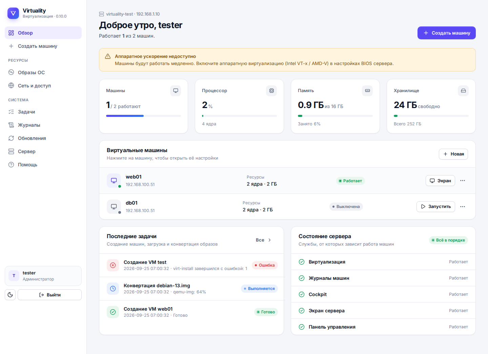
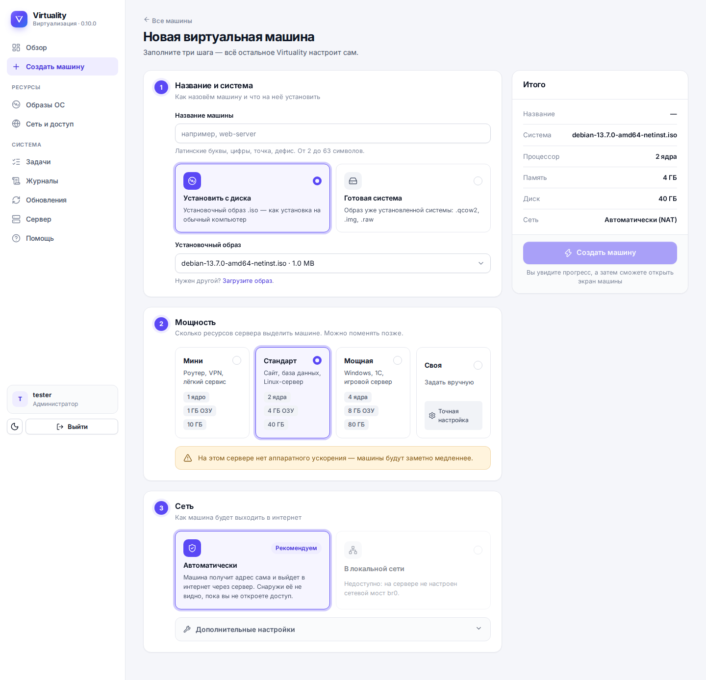
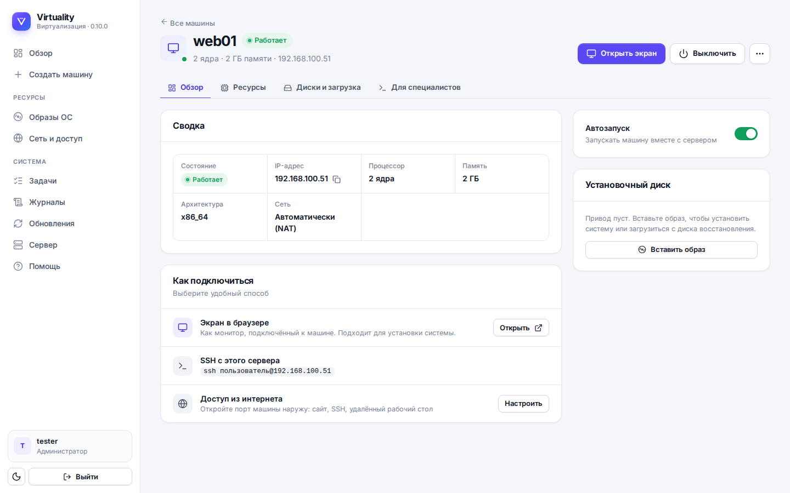
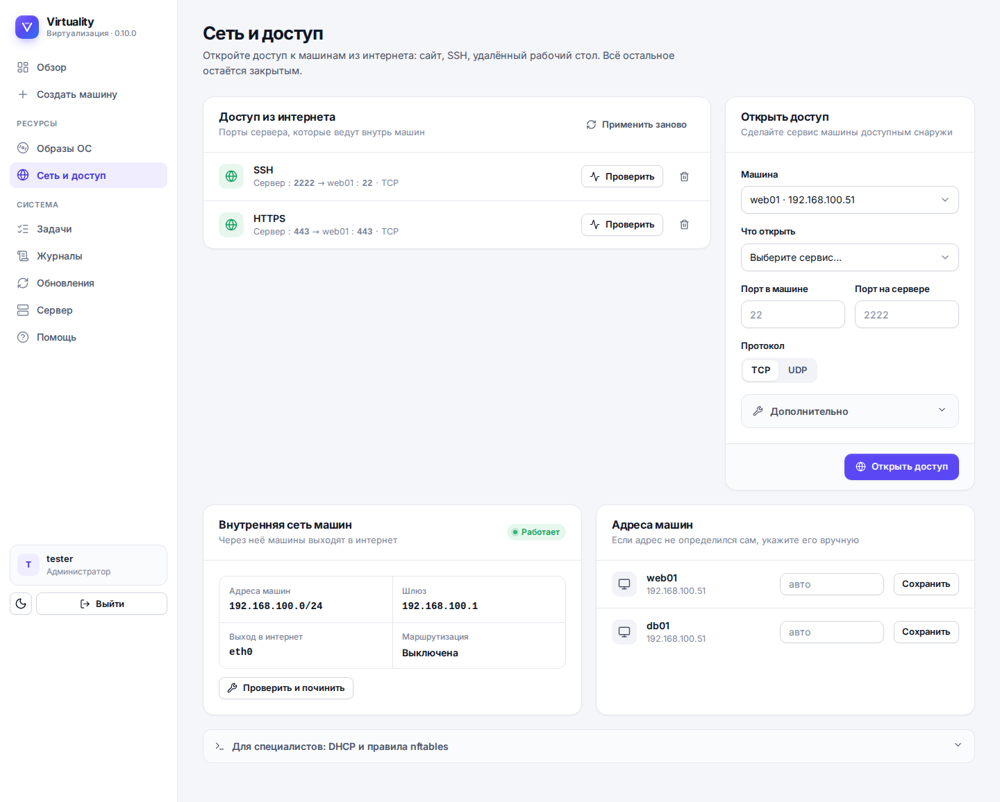
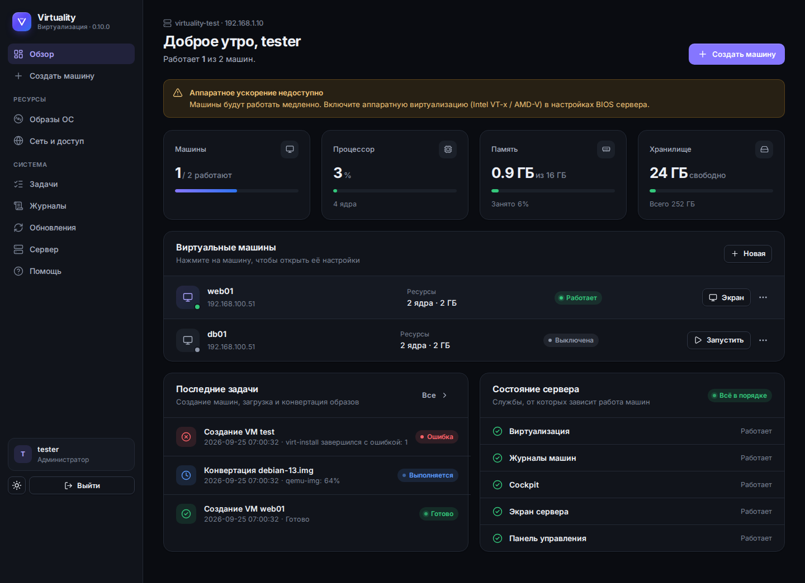

# Virtuality

**Virtuality** — лёгкая серверная платформа виртуализации на базе **KVM**, **QEMU**, **libvirt**, **Cockpit** и собственной web-панели.

Цель проекта — собрать понятную, компактную и расширяемую систему для управления виртуальными машинами, ISO-образами, NAT/bridge-сетью, пробросом портов, диагностикой, web-console/noVNC, backup/snapshot-функциями и будущей кластеризацией.

> Текущий статус: версия 0.10 — код панели покрыт тестами, есть установочный ISO-образ. Уже есть one-command установка, автоопределение профиля хоста, web-панель, авторизация через Linux-пользователя, ISO-менеджер, создание VM из интерфейса, журнал операций, NAT Router для VPS/ARM edge nodes и port forwarding.

---

## Поддерживаемые профили хоста

Virtuality автоматически определяет профиль сборки во время установки:

```text
x86_64                 # обычный сервер, домашний сервер, VPS
raspberry-arm64        # Raspberry Pi ARM64 edge node
orangepi5-arm64        # Orange Pi 5 / RK3588 ARM64 edge node
generic-arm64          # другая ARM64-плата
```

Профиль сохраняется здесь:

```text
/var/lib/virtuality/config/host_profile.json
```

В web-панели профиль виден на странице:

```text
/host
```

Для ARM64-плат правильный сценарий — **ARM64-гости**, NAT-сеть и позже cloud-image/cloud-init шаблоны. x86_64 ISO на Raspberry/Orange Pi не являются целевым режимом.



| Мастер создания машины | Страница машины |
|---|---|
|  |  |

| Сеть и доступ | Тёмная тема |
|---|---|
|  |  |

---

## Установка с ISO-образа

Для установки на «голое» железо собирается загрузочный ISO на базе чистого Ubuntu Server 26.04 LTS: установщик спрашивает только сеть, диск и пользователя, а при первой загрузке нода настраивается сама.

```bash
make iso               # dist/virtuality-<версия>-ubuntu-26.04-amd64.iso
make iso ARCH=arm64
```

Подробно: [`docs/IMAGE.md`](docs/IMAGE.md).

---

## Быстрая установка одной командой

Одна команда работает и под `root`, и под обычным пользователем с `sudo`:

```bash
curl -fsSL https://raw.githubusercontent.com/viktor138irk/virtuality/main/install.sh | bash
```

Как выбирается пользователь для входа в web-панель:

```text
Если запуск под root       → login: root
Если запуск через sudo     → login: текущий sudo-пользователь
Если задан VIRTUALITY_USER → login: указанный Linux-пользователь
```

Принудительно выбрать пользователя:

```bash
curl -fsSL https://raw.githubusercontent.com/viktor138irk/virtuality/main/install.sh | VIRTUALITY_USER=<linux_user> bash
```

Пример:

```bash
curl -fsSL https://raw.githubusercontent.com/viktor138irk/virtuality/main/install.sh | VIRTUALITY_USER=admin bash
```

Установка с авторизацией под `root`:

```bash
curl -fsSL https://raw.githubusercontent.com/viktor138irk/virtuality/main/install.sh | VIRTUALITY_USER=root bash
```

Если пароль выбранного Linux-пользователя не задан:

```bash
sudo passwd <linux_user>
```

Для root:

```bash
passwd root
```

---

## Что уже есть

- универсальная one-command установка через `install.sh`;
- автоопределение профиля хоста: x86_64, Raspberry Pi ARM64, Orange Pi 5 ARM64, generic ARM64;
- установка разных пакетных наборов под x86 и ARM64;
- красивый пошаговый installer с live-status и логами;
- preflight-проверка системных требований;
- установка KVM/QEMU/libvirt;
- установка Cockpit и Cockpit Machines;
- рабочая директория `/opt/virtuality/source`;
- libvirt storage pools `virtuality-images` и `virtuality-iso`;
- firewall-правила для SSH, Cockpit, VNC и web-панели;
- безопасная ручная настройка bridge `br0` через `netplan try`;
- NAT Router `virtuality-nat` для VPS/ARM edge nodes;
- port forwarding через nftables;
- автоматическое определение IP VM для проброса портов;
- healthcheck одной командой `vhealth`;
- консольный dashboard для физического монитора;
- web-панель Virtuality на FastAPI;
- авторизация web-панели через системного Linux-пользователя;
- `/host` — профиль хоста и проверки готовности;
- `/network` — NAT, DHCP leases, port forwarding, nftables preview;
- `/iso` — ISO-менеджер;
- `/operations` — журнал фоновых операций;
- список VM;
- управление VM: Start, Shutdown, Reboot, Power off, Autostart on/off, Delete VM with disks;
- создание VM из web-интерфейса;
- выбор сетевого режима при создании VM: `virtuality-nat` или `br0`;
- прогресс создания VM и live-лог `virt-install`;
- страница деталей VM: `dominfo`, VNC display, IP, диски, сетевые интерфейсы.

---

## Системные требования

Минимально для x86_64 тестового стенда:

```text
CPU: 2 ядра с Intel VT-x / AMD-V
RAM: 4 GB
/: минимум 8 GB свободно
/var/lib: минимум 20 GB свободно
OS: Ubuntu Server 26.04 / 24.04 LTS или Debian 13
Network: один проводной интерфейс
```

Рекомендуемо для x86_64:

```text
CPU: 4+ ядра
RAM: 16+ GB
Storage: 100+ GB SSD/NVMe под /var/lib/virtuality
Network: 1 Gbit/s+
OS: Ubuntu Server 26.04 LTS
```

ARM64 edge nodes:

```text
Raspberry Pi 4/5 ARM64: желательно 8 GB RAM
Orange Pi 5 ARM64: желательно 8/16/32 GB RAM и NVMe
Гости: ARM64 Linux VM
Сеть: virtuality-nat по умолчанию
```

Подробнее: [`docs/REQUIREMENTS.md`](docs/REQUIREMENTS.md)

---

## Порты

```text
Cockpit:       https://SERVER_IP:9090
Virtuality UI: http://SERVER_IP:8088
VNC:           5900-5999/tcp
SSH:           22/tcp
```

Изменить порт web-панели:

```bash
curl -fsSL https://raw.githubusercontent.com/viktor138irk/virtuality/main/install.sh | VIRTUALITY_WEB_PORT=8089 bash
```

Для VPS/ARM NAT-сценария входящие сервисы VM открываются через port forwarding в разделе `/network`.

---

## Директории

```text
/opt/virtuality/source                  # исходники проекта из GitHub
/opt/virtuality/web                     # установленная web-панель
/opt/virtuality/venv                    # Python virtualenv web-панели
/opt/virtuality/virtuality.env          # базовый env ноды
/var/lib/virtuality/config              # конфиги Virtuality
/var/lib/virtuality/config/host_profile.json
/var/lib/virtuality/iso                 # ISO-образы
/var/lib/virtuality/images              # qcow2-диски VM
/var/lib/virtuality/network             # port_forwards.json
/var/lib/virtuality/backups             # backups
/var/log/virtuality                     # логи установки и диагностики
/var/log/virtuality/operations          # JSON/log фоновых операций
/var/lib/virtuality/config/web.env      # настройки ноды: порт, пользователь, автообновление
/var/lib/virtuality/disk-images         # загруженные образы дисков
/etc/virtuality/nftables/virtuality.nft # nftables-правила Virtuality
```

---

## Диагностика

```bash
sudo vhealth
```

Дополнительно:

```bash
cat /var/lib/virtuality/config/host_profile.json
systemctl status virtuality-web --no-pager
journalctl -u virtuality-web -n 120 --no-pager
virsh list --all
virsh pool-list --all
virsh net-list --all
virsh net-dhcp-leases virtuality-nat
ip -br a
ip route
```

---

## Web-панель

URL:

```text
http://SERVER_IP:8088
```

Основные разделы:

```text
/              # дашборд
/host          # профиль хоста и проверки
/iso           # ISO-менеджер
/network       # NAT Router и проброс портов
/operations    # журнал операций
/vm/create     # создание VM
```

Переустановка web-панели:

```bash
cd /opt/virtuality/source
sudo bash scripts/install_web_panel.sh
```

Статус:

```bash
systemctl status virtuality-web --no-pager
```

Логи:

```bash
journalctl -u virtuality-web -f
```

Вход:

```text
Login: выбранный Linux-пользователь
Pass:  пароль этого Linux-пользователя
```

---

## Сеть: Bridge и NAT Router

### Bridge br0

Подходит для домашнего/офисного сервера, где VM должны получать IP из локальной сети.

По умолчанию one-command установщик **не включает `br0` автоматически**, чтобы не уронить SSH-сессию.

Сначала нужно посмотреть сетевой интерфейс:

```bash
ip -br a
ip route
```

Затем запустить bridge setup, например для `enp2s0`:

```bash
cd /opt/virtuality/source
sudo bash scripts/setup_bridge_br0.sh enp2s0 static
```

Ожидаемый результат:

```text
enp2s0  UP
br0     UP  SERVER_IP/24
default via GATEWAY dev br0
```

### Virtuality NAT Router

Подходит для VPS, Raspberry Pi, Orange Pi 5 и других ARM64 edge nodes.

Схема:

```text
Интернет / LAN
   ↓
Хост Virtuality
   ↓
virtuality-nat / virbr100
   ↓
VM 192.168.100.x
```

Создать или починить NAT-сеть можно в web-панели:

```text
/network → Создать / починить NAT-сеть
```

Параметры по умолчанию:

```text
Network: virtuality-nat
Bridge:  virbr100
Subnet:  192.168.100.0/24
Gateway: 192.168.100.1
DHCP:    192.168.100.50–192.168.100.200
```

Проброс порта добавляется в `/network`. IP VM определяется автоматически через `virsh domifaddr`, а если не получилось — через DHCP leases и MAC-адрес VM.

Пример SSH-проброса:

```text
VM:                  ubuntu-test
Внешний порт сервера: 2222
Порт внутри VM:       22
Протокол:             tcp
```

Подключение:

```bash
ssh user@SERVER_IP -p 2222
```

---

## ISO и создание VM

Загрузка ISO через web-панель:

```text
/iso
```

Создание VM:

```text
/vm/create
```

При создании VM можно выбрать сеть:

```text
VPS NAT Router — virtuality-nat
Bridge — br0 / локальная сеть
```

Для x86_64 можно использовать обычные x86_64 ISO. Для Raspberry Pi / Orange Pi 5 нужны ARM64 ISO или, в будущем, ARM64 cloud images.

Пример загрузки Alpine x86_64 ISO:

```bash
sudo wget -O /var/lib/virtuality/iso/alpine-standard-x86_64.iso https://dl-cdn.alpinelinux.org/alpine/v3.20/releases/x86_64/alpine-standard-3.20.3-x86_64.iso
sudo virsh pool-refresh virtuality-iso
```

---

## Обновление

Из web-панели: раздел `/update`. Вручную:

```bash
cd /opt/virtuality/source
sudo git pull
sudo bash scripts/install_web_panel.sh
sudo systemctl restart virtuality-web
```

Порт панели, пользователь и режим автообновления сохраняются в `/var/lib/virtuality/config/web.env` и не сбрасываются при обновлениях.

Полная повторная установка компонентов ноды:

```bash
cd /opt/virtuality/source
sudo bash install_virtuality_node.sh
sudo bash scripts/install_web_panel.sh
```

---

## Продакшен-настройки

Настройки ноды — `/var/lib/virtuality/config/web.env`:

```text
VIRTUALITY_WEB_PORT=8088        # порт панели
VIRTUALITY_WEB_HOST=0.0.0.0     # 127.0.0.1, если панель стоит за reverse proxy
VIRTUALITY_AUTH_USER=admin      # Linux-пользователь для входа
VIRTUALITY_AUTO_UPDATE=1        # 0 — отключить ночное автообновление с GitHub
VIRTUALITY_COOKIE_SECURE=0      # 1 — cookie только по HTTPS (за reverse proxy с TLS)
```

После изменения: `cd /opt/virtuality/source && sudo bash scripts/install_web_panel.sh`. Любой параметр можно передать и переменной окружения при установке, например `VIRTUALITY_AUTO_UPDATE=0`.

Рекомендации:

- для продакшена отключите автообновление (`VIRTUALITY_AUTO_UPDATE=0`) и обновляйтесь вручную через `/update` после проверки версии;
- открывайте панель наружу только через HTTPS reverse proxy (nginx/Caddy) с `VIRTUALITY_WEB_HOST=127.0.0.1` и `VIRTUALITY_COOKIE_SECURE=1`;
- reverse proxy должен передавать исходный `Host` (nginx: `proxy_set_header Host $host;`, для noVNC-консоли ещё `Upgrade`/`Connection`), иначе панель отклонит POST-запросы как cross-origin;
- мониторинг: `GET /healthz` без авторизации возвращает `{"ok": true, "version": "..."}`;
- после 5 неверных паролей вход с этого адреса блокируется на 5 минут; сессия живёт 12 часов;
- правила проброса портов восстанавливаются после перезагрузки сервисом `virtuality-network.service`.

---

## Разработка

```bash
pip install -r web/requirements.txt -r requirements-dev.txt
make check                       # pyflakes + shellcheck + pytest
python3 tests/dev_server.py      # панель на http://127.0.0.1:8765 с имитацией virsh, вход: любой пароль
```

Интерфейс: шаблоны `web/templates` (общий каркас `base.html`, компоненты `_ui.html`), стили `web/static/app.css` (светлая и тёмная темы на CSS-переменных), поведение `web/static/panel.js`. Шрифт Inter и иконки Lucide лежат в `web/static` — панель работает без доступа в интернет.

Код панели лежит в `web/` целиком и устанавливается как есть. Патчить `app.py` во время установки больше не нужно: изменения вносятся прямо в `web/` и покрываются тестами в `tests/`. GitHub Actions запускает проверки на Python 3.11–3.13 и собирает ISO по тегу `v*`.

---

## Полезные команды

```bash
sudo vhealth
virsh list --all
virsh pool-list --all
virsh net-list --all
virsh net-dhcp-leases virtuality-nat
ip -br a
ip route
sudo nft list ruleset
sudo ufw status
systemctl status libvirtd --no-pager
systemctl status cockpit.socket --no-pager
systemctl status virtuality-web --no-pager
journalctl -u virtuality-web -f
```

---

## Roadmap

- ARM64 cloud-image templates;
- cloud-init для быстрых VM;
- управление storage pools;
- backup/snapshot manager;
- сетевой менеджер bridge/VLAN;
- роли и права пользователей;
- журнал событий;
- кластеризация;
- готовые образы для Raspberry Pi / Orange Pi 5.

---

## Лицензия

Рекомендуемая лицензия: **MIT License**.
